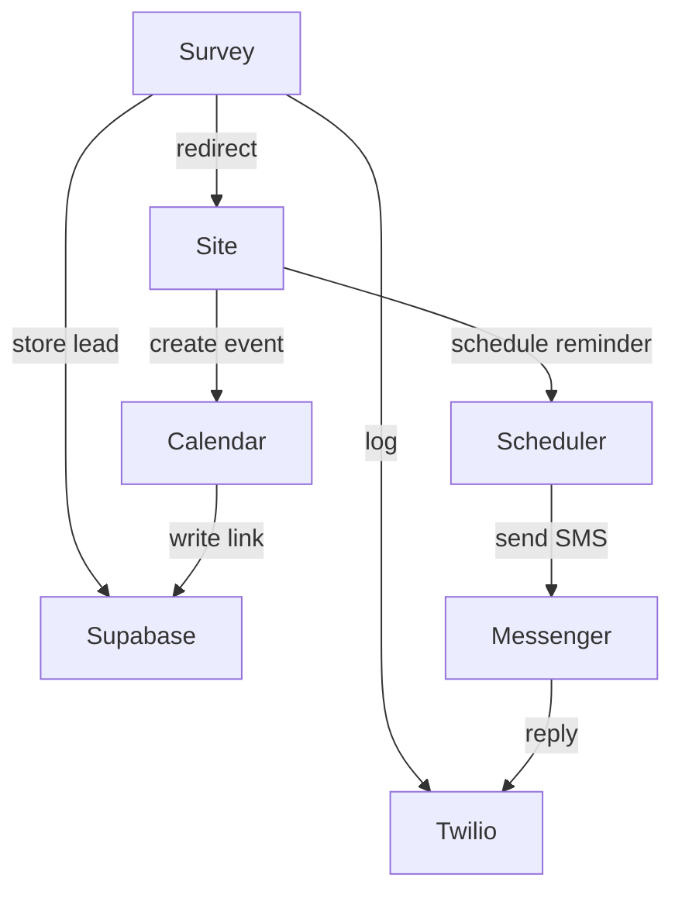

# Survey and Site User Flow

This guide explains how the survey site connects with the microservices to deliver the end-to-end user experience. Markers like `[1a*]` denote branching paths in the flow.

## 1. Survey Entry
1. The user opens the survey and answers the questions.
2. All data from the survey is stored in **Supabase** and logged to **Twilio**.
3. Depending on the answers the flow splits:
   - **[1a\*] Qualified** – the user is redirected to the booking site at `ip:port/realtor_id/user_marker`. The `user_marker` pre-fills the name and phone fields.
   - **[1b\*] Needs Follow-up** – the user is shown a message that a realtor will soon contact them. A separate system message is queued for the AI assistant.

## 2. On the Site ([1a\*])
Once on the booking site two scenarios may occur:
- **[2a\*] Immediate Booking** – if the user books a time within five minutes, a confirmation message is sent:
  > “Thank you for booking a meeting with {realtor_name} at {date} {time}. {realtor_name} will soon enter contact with you.”
  Sending additional messages does nothing.
- **[2b\*] No Booking Yet** – if no booking is made within five minutes, a cron job schedules a reminder SMS via the Scheduler service.

Each booking writes a Google Calendar event and stores its link and phone number in Supabase. When users reschedule, the site reads updated times from Google Calendar and confirms the change.

## 3. SMS Tools ([1b\*] and [2b\*])
Users who remain in the messaging flow can interact via three commands:
1. **Book** – schedule a date and time.
2. **See availability** – list open time slots.
3. **Stop** – opt out of future messages.

The Messenger service receives incoming SMS through Twilio, generates a response using OpenAI, and sends the reply immediately.

## 4. Microservice Connections

Supabase acts as the central database while each microservice (Calendar, Scheduler, Messenger) focuses on a single responsibility. OpenAI is invoked by Messenger whenever a user sends a message so responses are immediate and contextual.
